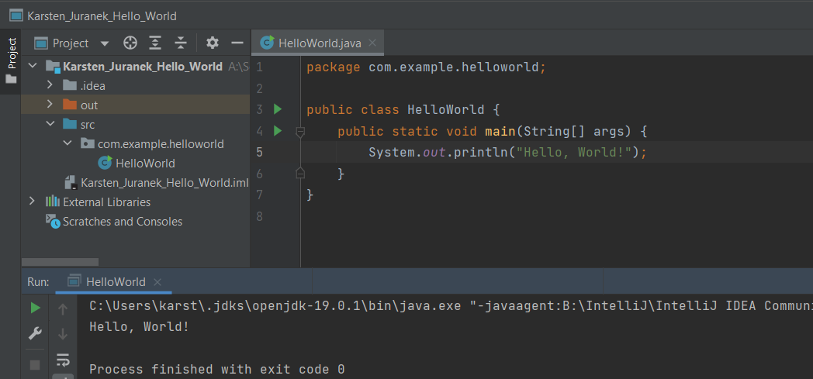

<h1>HelloWorld</h1>

Hello, World! by *Karsten Juranek*

<h2>Requirements</h2>

* you need the downloaded file,

* a programming enviroment

* and java knowledge

<h2>Installation and Usage</h2>

1. Download the file

2. Open it in your programming enviroment

3. Click on Run

